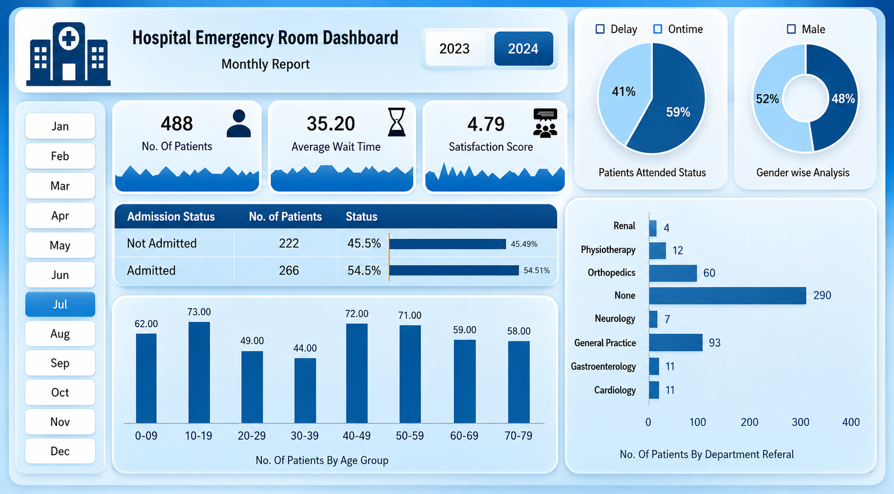

# 🏥 Hospital Emergency Room Dashboard

> 📊 An interactive Power BI dashboard designed to analyze hospital emergency room patient data and transform it into meaningful healthcare insights.

---

## 🖼️ Dashboard Preview

---

## 📊 Project Overview

The **Hospital Emergency Room Dashboard** is an interactive data analytics project created using **Microsoft Power BI** to analyze and visualize hospital emergency room patient data.

This project follows an **Iterative Dashboard Design** approach, where the dashboard is developed and refined to present complex healthcare data through clear visualizations, KPIs, and interactive filters.

The dashboard provides insights into patient volume, admission status, age groups, waiting time, timeliness, gender distribution, patient satisfaction, and department referrals.

---

## 🎯 Project Objectives

The main objective of this project is to transform emergency room patient data into meaningful and easy-to-understand insights.

### Key Objectives

- Analyze the total number of emergency room patients.
- Understand patient admission and non-admission rates.
- Analyze patients across different age groups.
- Measure patient waiting time and timeliness.
- Analyze patient distribution by gender.
- Identify departments receiving the highest number of referrals.
- Monitor patient satisfaction.
- Analyze monthly patient trends.

---

## 🔍 Key Insights & Analysis

### 🏥 Patient Admission Status

Shows the number and percentage of patients who were **admitted** and **not admitted**.

### 👥 Patient Age Analysis

Groups patients into different age ranges to understand the distribution of emergency room patients.

### ⏱️ Timeliness Analysis

Measures the percentage of patients seen within the expected time and compares **on-time** versus **delayed** patients.

### ⚥ Gender Analysis

Displays the distribution of patients by gender to understand demographic patterns.

### 🏨 Department Referral Analysis

Identifies which hospital departments receive the highest number of patient referrals.

### 📅 Monthly Analysis

Allows users to explore patient data month by month using interactive filters.

### ⭐ Patient Satisfaction

Provides an overview of the patient satisfaction score.

### ⏳ Average Wait Time

Shows the average time patients wait before receiving attention.

---

## 🛠️ Tools & Technologies

- **Microsoft Power BI**
- **Power Query**
- **Microsoft Excel**
- **Data Cleaning**
- **Data Transformation**
- **Data Analysis**
- **Data Visualization**
- **Dashboard Design**

---

## 📌 Dashboard Features

- 📅 Interactive monthly filters
- 📆 Year selection
- 📊 KPI cards
- 🏥 Admission status analysis
- 👥 Age-group analysis
- ⚥ Gender analysis
- ⏱️ Timeliness analysis
- 🏨 Department referral analysis
- ⏳ Average wait time
- ⭐ Patient satisfaction score
- 📈 Interactive data visualizations

---

## 📈 What I Learned

Through this project, I gained practical experience in:

- Cleaning and transforming data using **Power Query**
- Creating interactive dashboards using **Power BI**
- Selecting appropriate visualizations for different types of data
- Creating meaningful KPIs
- Analyzing healthcare-related datasets
- Applying an **iterative approach to dashboard design**
- Presenting complex data in a simple and understandable format

---

## 🚀 Project Outcome

This project helped me strengthen my skills in:

**Data Analysis • Power BI • Power Query • Data Visualization • Dashboard Design**

It also gave me hands-on experience in converting raw data into an interactive dashboard that communicates important insights clearly and effectively.

---

## 👩‍💻 Author

**Riya Gohel**

Aspiring Data Analyst | Power BI | Excel | SQL | Python

---

## ⭐ Project Highlights

- 📊 Interactive healthcare dashboard
- 🔎 Data-driven insights
- 🎨 Clean and user-friendly dashboard design
- 📈 Multiple visualization techniques
- 🔄 Iterative dashboard development
- 💡 Practical data analytics experience

---

## 📂 Project Files

| File | Description |
|------|-------------|
| `POWER_BI_DASHBOARD.png` | Dashboard preview |
| `Dashboard.xlsx` | Dataset used for analysis |
| `README.md` | Project documentation |

---

⭐ **If you find this project useful, feel free to explore the repository and connect with me!**
